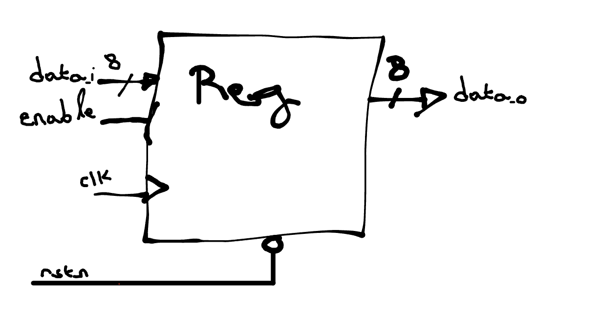

# Specification: 8-bit Enable Register

## Objective
Design an 8-bit register in SystemVerilog with the following behavior.

## Functional Requirements

- `data_i` and `data_o` are both 8-bit logic vectors.
- `rstn` is asynchronous and active-low.
- The register samples on the **rising edge of `clk`**.
- When `enable` is high, the register **captures `data_i`** into `data_o`.
- When `enable` is low, the register **retains** the previous value of `data_o`.

## RTL Guidelines

- Use `always_ff` (SystemVerilog).
- Declare `timeunit` and `timeprecision`.
- Design should be synthesizable.

## I/O Ports

| Signal  | Direction | Width | Description                        |
|---------|-----------|-------|------------------------------------|
| clk     | Input     | 1     | Clock signal                       |
| rstn    | Input     | 1     | Asynchronous active-low reset      |
| enable  | Input     | 1     | Enable input                       |
| data_i  | Input     | 8     | Input data                         |
| data_o  | Output    | 8     | Registered output                  |

## Bonus Ideas for Exploration
- Modify the register to have synchronous reset.
- Parameterize the width (e.g., `parameter WIDTH = 8`).
